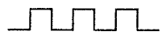

Source: [NCH Roof Standards](../assets/nch-roof-standards.pdf)

# Alternative Roofing Product Specifications
Approved by North Creek Heights Board, September 2007

Current guidelines require all roofing in North Creek Heights is to be cedar shake or ceramic tile unless specifically approved by the ACC (Article VIII, Section 10, Paragraph (a)). Given the age of North Creek Heights homes, the availability of high quality composition and synthetic roofing, and fire safety related concerns to using cedar shakes, roofing materials within the following guidelines have been approved for use within North Creek Heights:

## 1. Cedar Shake
- All re-roofing projects which replace the existing roof with identical materials do not need prior ACC approval. This includes medium and heavy Handsplit, Resawn and Taper-Sawn shakes.

## 2. High Dimensional Fiberglass Composition
- Pumpkin-tooth design with minimum .375” relief (measured from one major tier to the next)
  - Pumpkin tooth cut:
  
  
- Minimum UL wind rating of 80 mph
- Minimum manufacturers warranty of 40 years
- Class A fire rating
- Roof, hip, and ridge caps must be of the same manufacturer and consistent in color and material.
- A manufacturer’s specification sheet and/or color brochure must be submitted with OHC Improvement Application and approved by ACC prior to installation. Acceptable colors are brown, wood and grey tones (similar to the color of natural or treated cedar shake).
- Colors that will not be accepted include, but are not limited to, white, red, green, blue, purple, orange, or yellow.
- All such alternative composition roofing products must closely blend with the coloration, texture, design and overall appearance of a cedar shake roof as well as the community.

## 3. Imitation Shake / Tile
- Minimum UL wind rating of 80 mph
- Minimum .375” relief (measured from one major tier to the next)
- Class A fire rating
- A manufacturer’s specification sheet and/or color brochure must be submitted with OHA Improvement Application and approved by ACC prior to installation. Acceptable colors are brown, wood, and grey tones (similar to the color of natural or treated cedar shake).
- Colors that will not be accepted include, but are not limited to, white, red, green, blue, purple, orange, or yellow.
- All such imitation or tile roofing products must closely blend with the coloration, texture, design and overall appearance of a cedar shake roof as well as the community.