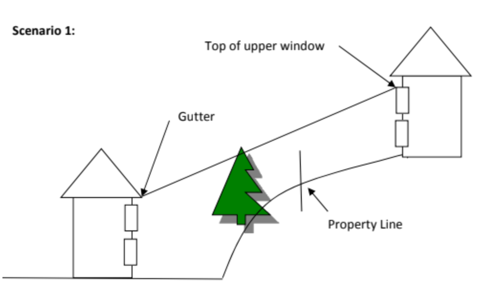
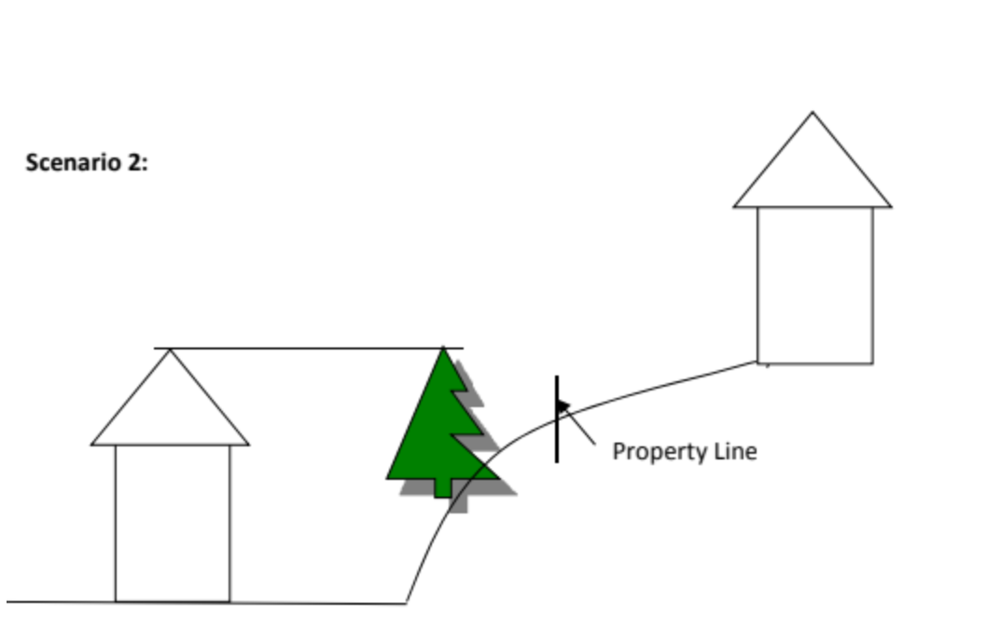
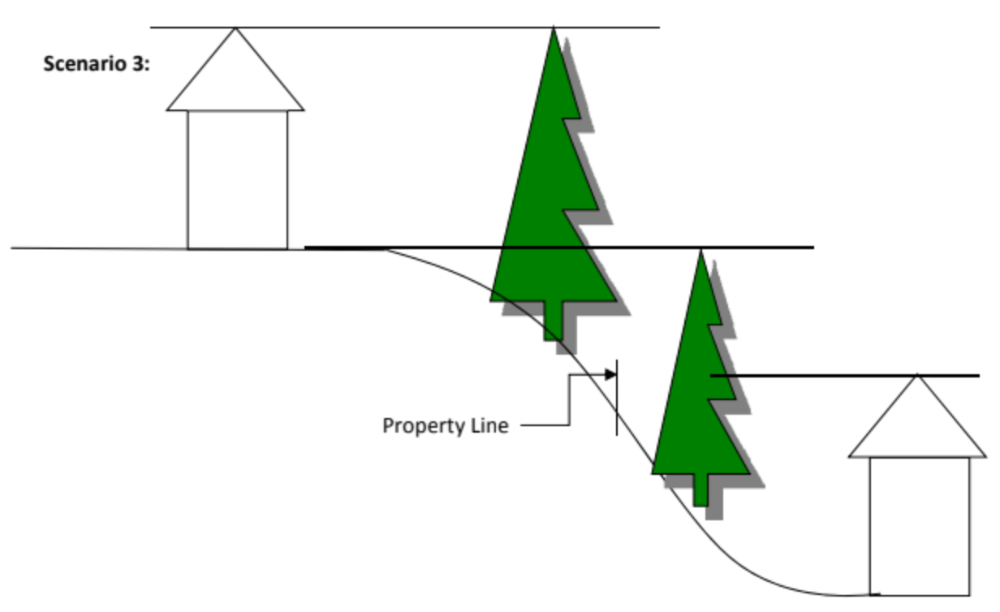
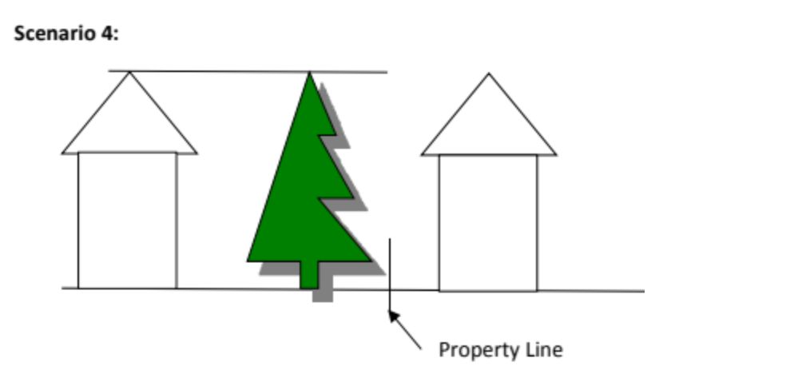
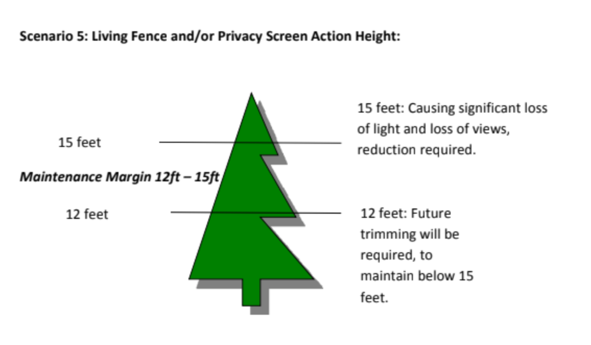

Source: [NCH Tree Standards](https://docs.google.com/document/d/1ZF6VfPP4dMfRrFaGdaVELtHviUKNa4tW/edit)

**IMPORTANT - All fences of any material including living fences must be [approved](../contact) by the HOA board before installation according to the [NCH HOA Declaration](declaration#exterior-maintenance).**

No fences of any material including living fences may be built or maintained that either restricts or substantially blocks a homeowner’s view from any neighboring lots or encroaches onto a neighboring lot.

## Definition
A “Living Fence” or “Privacy Screen” is defined as a planting of any shrub, bush, hedge, or tree that  
grows to over 4 feet tall, three or more planted close enough that their branches touch and the sight between the plants is obstructed. This is a living barrier that is intentionally grown for confinement, privacy, and means of protection or use as a boundary.

Living Fence Requirements:

A living fence may not be higher than outlined in the attached scenarios or have outgrown its function.

### Height Restrictions and Maintenance

Applies to new or existing living fences, privacy screens, or large singular trees that block homeowner’s views. One or more of the scenarios listed below may apply relative to neighboring home elevations.

The maximum height of a living fence/privacy screen must be maintained at or below 15 feet tall  
from the base or not be taller than the lot owner’s highest roof ridge, whichever is tallest.  
([Scenario 1](#scenario-1) or [Scenario 2](#scenario-2))

Living fences/privacy screens may not be taller than the foundation height of the immediately adjacent neighbor's house ([Scenario 3](#scenario-3))

Living fences/privacy screens must not encroach onto a neighboring lot.  
Living fence/privacy screen must be maintained below the view of the ridgeline from the  
neighboring lot owner’s property ([Scenario 1](#scenario-1) or [Scenario 2](#scenario-2))

The maximum height and width of the living fence must be determined at the time of the request for approval, and placement of the plantings must be such that the living fence shall not violate these requirements at growth maturity. The size, full growth, and maturity of all species of the living fence must be specified in the request for approval.

As living fences may exceed the height of an approved ACC fence (6 feet), shade patterns of living fences may cause physical damage to the neighboring lot owner’s property by not enabling sunlight to reach said property. The portion of the living fence above 8 feet from the soil level shall be pruned in such a manner as to permit sunlight penetration to neighboring lots.

Privacy and screening will be considered, as well as the views of all property owners 
within the NCHHOA development.

By seeking approval for a living fence, the lot owner agrees to maintain the living fence in accordance with the ACC requirements noted herein.   
If the living fence is in existence, the homeowner agrees to maintain the living fence in accordance with the ACC requirements noted herein.

### Detailed Maintenance Description

1. Any trees, hedges, or living fence that block any percentage of views above roof ridgelines as described herein, impair access to sunlight, or encroach on the adjacent property must, at the owner’s expense, be trimmed, topped, or replaced.  
2. If the trees or living fence encroaches onto an adjacent lot, the owner of the encroached lot shall jointly notify the encroaching lot owner and the ACC landscaping committee.  
3. 

The lot owner then has 30 days to cure the violation or the NCHHOA will need to act as outlined in the NCHHOA View Enforcement guidelines noted herein.

### Native Trees Exemption

All native trees that were preserved at the time of the original North Creek Heights development are exempt from this requirement. The property owner in which the Native Tree(s) resides is responsible for proper maintenance of the native tree or trees, as stated in the NCHHOA CC\&Rs.

### NCHHOA View Enforcement Guidelines

The North Creek subdivision was built with views of properties that are within its boundaries. Property Owners have 30 days from the time they have been notified by any neighbor to correctly maintain the height of trees or fences as outlined in the CC\&Rs. Lack of notification is not validation or approval of the living fence, tree(s), or fence, and maintenance thereof.

**Examples:**  
The following scenarios are examples of situations that may occur in the North Creek Heights subdivision. Other possible scenarios are not limited to only the diagrams shown. The examples show privacy guidance and view enforcement.  

### Scenario 1

### Scenario 2

### Scenario 3

Pertains to the height of trees, hedges, living fences and shrubs that are located on a lot owner’s property, which are visible from any neighbor’s homes first floor or above living areas.

### Scenario 4

Pertains to the height of trees, hedges, living fences and shrubs that are located on a lot owner’s property, which are visible from any neighbor’s homes first floor or above living areas.

### Scenario 5

Demonstrates maintenance margin: no action, future trimming required, and height reduction required.